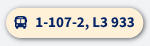
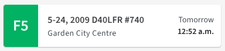
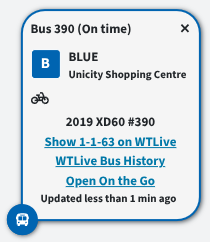
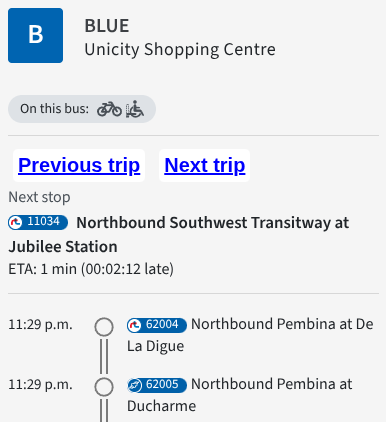
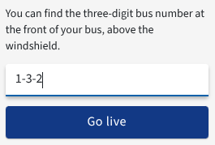
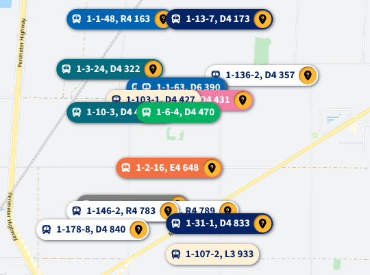
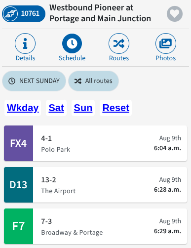

# wt-websocket-tracker

A patch for the Winnipeg Transit web app which improves the functionality of the new WebSocket-based live tracking system, mainly geared towards transit photographers and enthusiasts.

## Features

- Show the run code, fleet number, and vehicle model on:
    - Bus icons on the map, instead of the route number (e.g. "1-110-1, L3 945" instead of "888"). **Shortened model names**
        - The full model name in the popup (e.g. "2001 D30LF #938")

    

    - Stop schedules, instead of a redundant route name (e.g. "110-1, 2001 D30LF #945" instead of "Tache").

    

    - Stop schedule previews, in addition to the route destination (e.g. "Whittier Park (110-1, L3 945)" instead of "Whittier Park"). **Shortened model names**
    - Fleet numbers and vehicle models are omitted if a bus has not yet been assigned to a run. Run codes are always available.
    - Shortened model names (model years are omitted due to space constraints):
        - L3 / L4: D30LF / D40LF
        - R4: D40LFR
        - X4 / X6: XD40 / XD60
        - E4 / E6: XE40 / XE60
        - H4 / H6: XHE40 / XHE60
- When clicking on a bus icon, add links to [WTLive](https://www.wtlivewpg.com) for the bus's run and the bus history for the vehicle, and to On the Go for the vehicle.

    

- Show how late or early a bus is on its bus icon and its On the Go page, calculated as the difference between scheduled and estimated stop times.
- When using On the Go, continuously update the "Next stop" section with the bus's next stop instead of remaining static after the page loads.
- When using On the Go, add buttons for "Previous trip" and "Next trip" similar to when using the Trip Schedules page.

    

- Add support for using On the Go with a run code, provided a bus is currently operating that run and has live location data.

    

- Display the actual scheduled/live arrival times for past stops, instead of just displaying "Past".
- Add a live tracker of all buses in the system (or a specific list of fleet numbers) on a map, for example:
    - [https://winnipegtransit.com/routes/customtracker/details?show-vehicles=all](https://winnipegtransit.com/routes/customtracker/details?show-vehicles=all): Track all vehicles in the system, including On-Request and work buses when they are active.
        - **Caution**: Tracking all vehicles may cause significant performance issues or crash the page, especially on mobile devices.
    - [https://winnipegtransit.com/routes/customtracker/details?show-vehicles=284-299,641-664](https://winnipegtransit.com/routes/customtracker/details?show-vehicles=284-299,641-664,930-949,980): Track all Zero-Emission buses (X(H)E40s and X(H)E60s) in the system, as of May 2026.
    - [https://winnipegtransit.com/routes/customtracker/details?show-vehicles=292-299,371-398,475-497](https://winnipegtransit.com/routes/customtracker/details?show-vehicles=292-299,371-398,475-497): Track all articulated buses in the system, as of May 2026.
    - [https://winnipegtransit.com/routes/customtracker/details?show-vehicles=177,337,907,973,980,985,990,991](https://winnipegtransit.com/routes/customtracker/details?show-vehicles=177,337,907,973,980,985,990,991): Track all wrapped buses, data from [WTLive](https://www.wtlivewpg.com/Pages/Tracker/BusHist/Buses/) as of May 2026.
- Tracking buses by route is also possible by using the `show-routes` query parameter instead of `show-vehicles`, for example:
    - [https://winnipegtransit.com/routes/customtracker/details?show-routes=BLUE](https://winnipegtransit.com/routes/customtracker/details?show-routes=BLUE): Track all buses on route BLUE (this has little difference compared to the official tracking page for that route).
    - [https://winnipegtransit.com/routes/customtracker/details?show-routes=101,102,103,104,105,106,107,108,109,110,111,112](https://winnipegtransit.com/routes/customtracker/details?show-routes=101,102,103,104,105,106,107,108,109,110,111,112): Track all buses serving On-Request zones (routes 101-112).
    - [https://winnipegtransit.com/routes/customtracker/details?show-routes=FX2,D10,22,223,101](https://winnipegtransit.com/routes/customtracker/details?show-routes=FX2,D10,22,223,101)
- Show the number of buses on the map, and the number of buses without GPS data.

    

    - For buses without GPS data, place them in a grid based on their fleet numbers in the southwest of the city outside the service area instead of hiding them. They still contain the same information in their icons and popups as the buses with GPS data.
    - Buses are removed from the grid and placed on the map once they receive GPS data.

    

- Add buttons to view a stop's schedule on the next weekday, Saturday, or Sunday, beginning at the start of service. This makes it easier to see full stop schedules without manually changing the date and time.

    

## Installation

### Mobile Installation

Use the following steps to install the patch on a mobile device browser:

1. Install ProxyPin ([iOS](https://apps.apple.com/app/proxypin/id6450932949), [Android](https://play.google.com/store/apps/details?id=com.network.proxy), [GitHub](https://github.com/wanghongenpin/proxypin)) and follow its instructions to set up a proxy server on your device, including installing the CA certificate.
2. Download [proxypin-scripts.json](https://github.com/cyrilsli/wt-custom-tracker/releases/latest/download/proxypin-scripts.json), a configuration file for ProxyPin.
3. Open ProxyPin, and go to the "Configuration" tab (document icon).
4. Go to "Script", ensure "Enable Script" is on, and tap "Import" to import the downloaded `proxypin-scripts.json` file.
5. Go to the main tab (three circles icon) and tap the play button to start the proxy server.
6. Reload this page in your browser to install the patch. You will be redirected to the WT web app and back to this page after the patch is installed.
7. Turn off the proxy server in ProxyPin by tapping the stop button on the main tab, then exit the app.
8. Feel free to clear ProxyPin's history (by tapping the trash can icon on the main tab) to improve its performance.
9. ProxyPin does not need to be running to use the patched WT web app, but it must be running **BEFORE** you access an updated version of the web app (see below).

**IMPORTANT**: Check this page every time **before using the WT web app**. If the "Status" section shows "update required", you must enable ProxyPin and refresh the page to install the latest patch. If you do not do so, a new unpatched version will be loaded and you must [clear your browser data](https://support.google.com/chrome/answer/2392709?hl=en) before you can install the patch again.

You do not need to check this page before using a link from the [Link Generator](https://cyrilsli.github.io/wt-custom-tracker/#link-generator), as they will redirect you to this page first if your patch is out of date.

### Desktop Installation

Use the following steps to install the patch on a desktop browser:

**IMPORTANT**: After a new version of the WT web app is released you must follow the steps below to reinstall the patch. You **do not** need to clear your browser data.

1. Open [https://winnipegtransit.com/](https://winnipegtransit.com/) in a new browser tab.
2. Open Developer Tools (usually by pressing F12 or Ctrl+Shift+I) and go to the "Network" tab.
3. Type `index` in the filter box, then reload the WT web app page.
4. There should be a single request shown, override its content (on Chrome, right-click the request and select "Override content").
5. **If you are updating from a previous version**: Apart from the currently selected or highlighted file, delete all other overridden files under the `winnipegtransit.com` folder starting with `index-`.
6. Select all the content of the overridden `index.js` file and delete it, leaving it empty.
7. Open [index-js-patch.js](https://raw.githubusercontent.com/CyrilSLi/wt-custom-tracker/refs/heads/main/index-js-patch.js) in a new browser tab, copy all of its contents, and paste it into the overridden `index.js` file.
8. Save the changes to the overridden `index.js` file.

**IMPORTANT**: You must have Developer Tools open on a tab before you can access the patched WT web app. You can still use the unpatched WT web app without Developer Tools open. You can uncheck "Disable cache" in the Network tab of Developer Tools to improve performance.

ProxyPin is not required to install the patch on a desktop browser, and you can ignore any ProxyPin messages in the "Status" section.